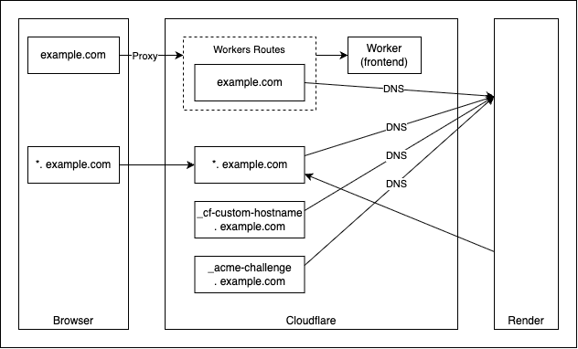

# カスタムドメイン設定

## 方針

- 以下のようにカスタムドメインを設定する
  - カスタムドメイン: Cloudflare で購入
  - フロントエンド: https://example.com
  - バックエンド: https://api.example.com
  - メールサービス: ~@example.com

## 途中作業

- Cloudflare
  - カスタムドメインを購入: https://www.cloudflare.com/ja-jp/products/registrar/
  - Workers の「Settings」→「Domains & Routes」→「Add」→「Custom domain」 → example.com を設定【あとで変更】
    - 自動で DNS 設定に「CNAME example.com Workers」が設定される
- Render
  - 「Settings」→「Custom Domains」→「Add Custom Domain」→ api.example.com を設定【あとで変更】
  - Cloudflare の「Domains」→「DNS」→「Records」→「Add record」で「CNAME api.example.com BackendURL」を設定【あとで変更】
- Resend
  - 「Domains」→「Add domain」から Cloudflare と連携して自動設定(簡単！！)
    - 自動で DNS 設定に MX 1 つ、TXT 2 つが追加される

## 詰まったところ

- 事象
  - Render にて api.example.com カスタムドメインが認証されない(証明書が取得できない？)
- 原因
  - Render に対して DNS でルートドメインを割り当てる必要がある
    - 参考: [Adding a wildcard custom domain without the base domain](https://render.com/docs/configure-cloudflare-dns#adding-a-wildcard-custom-domain-without-the-base-domain)
  - 上記ドキュメントを参考に、以下のように構成
    - ルートドメイン含め、(Render で指示があった) 4 つの DNS を Render に設定
    - Render では \*.example.com をカスタムドメインに設定
    - Cloudflare の Workers Routes で example.com へのアクセスを Frontend の Worker へリダイレクト

